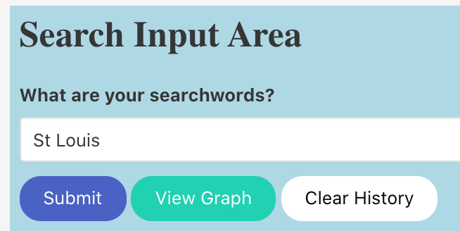
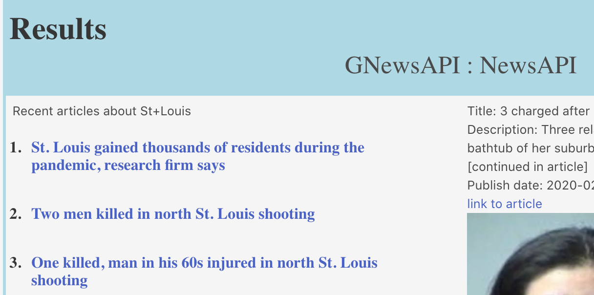
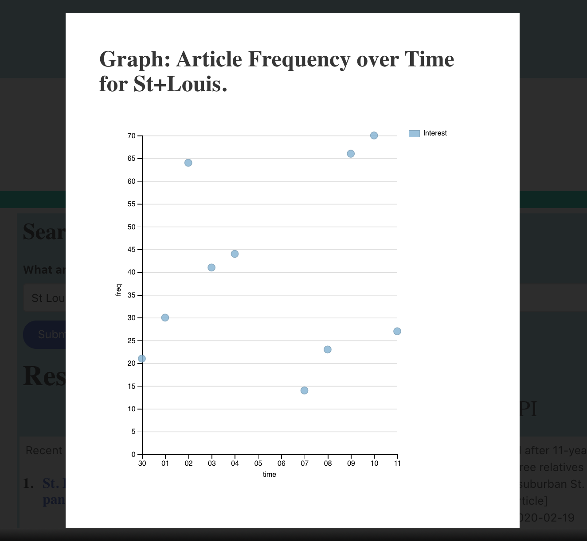

[github.io/three-word-history](https//nguyenjohnnyt.github.io/three-word-history)

# Three Word History

## Description

Find articles from throughout time in periodical, article, and blog formats and see a graphical representation of the topic's published trending history.

Three-Word-Hostory will simultaneously send your searchwords back in time to the earliest posted articles from GNewsAPI, as well as to the newest articles and blogposts from newsAPI, and report them for you side by side.  This perspective, along with a scatter plot of the frequency of all articles matching your searchwords over time allows you to see when the articles were trending in history, and how the information in the articles you're reading fit into the overall story's timeline in history.

Teachers, students, historians, writers, and researchers can quickly and easily find, qualify, and compare information as it fits into the bigger story.  

## Table of Contents

* [Installation](#installation)
* [Usage](#usage)
* [Credits](#credits)
* [License](#license)

## Installation

This is web applicatation will run automatically on any modern web browser with access to the internet.  It is responsive to screens of all sizes.  Simply point your browser to [github.io/three-word-history](https//nguyenjohnnyt.github.io/three-word-history)

## Usage 
### Search Input

To begin, enter one or more searchwords into the text input field.  The terms the user enters will be searched with AND logic.  If too many terms, or terms that are too obscure are entered, no results will be found.  In this case, the user will be prompted to enter different terms.

Click the blue Submit button to send the searchwords to queary two separate API's at once, newsAPI and GNews API.

### Results

The results will appear in two colums below the search input and buttons area.  The first column is sorted oldest first, and lists search hits from GNewsAPI.  The second column lists the results from newsAPI, and is sorted newest first.

### Scatterplot
Clicking on the green View Graph button will launch a modal window that displays a scatterplot graph showing how many articles were published on each day in history.  This information will indicate the location of a story on its historical journey.

### Search History
As an additional feature, Three-Word-History offers a convenient search history in the form of clickable buttons that wil return results from your previous searches.

## Credits

Johnny Nguyen
Cristina Tepelikian
Peter Alexander
James Boblak

Bulma CSS Framwork
Dimple D3 API
JavaScript
HTML
CSS
GitHub
[The Net Ninja youtube tutorial series](https://www.youtube.com/channel/UCW5YeuERMmlnqo4oq8vwUpg)

## License

This software, Three-Word-History, is protected and encouraged under the basic GNU General Public License v3.0 outlined [here](./COPYING.rtf).

---

## Contributing
If you are interested in contributing to this app, please follow the [Contributor Covenant](https://www.contributor-covenant.org/).